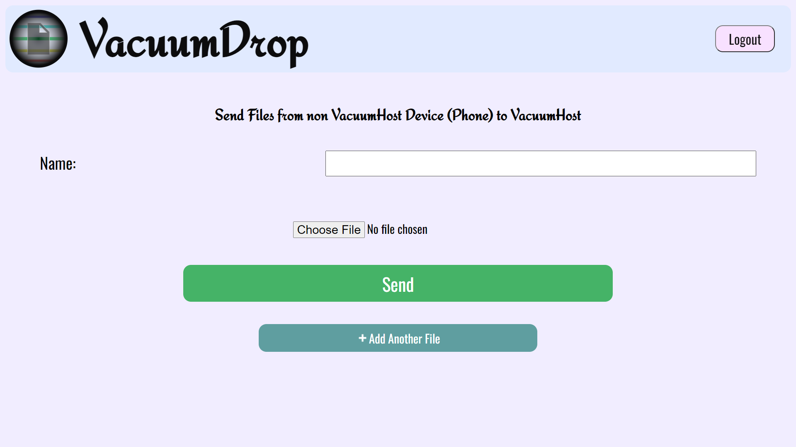

# VacuumDrop

VacuumDrop is an app which can be used to share files across devices in a Local Network. It can also be used to turn your computer into a local cloud, as the device running VacuumDrop serves the `Vacuum` folder and all its contents are accessible to all the devices in the network.

## Index

1. [Getting Started](#GettingStarted)
2. [How it works?](#Working)
3. [Sending files to PC](#SendingToPC)
4. [Saving files in Vacuum](#SendingToVacuum)
5. [Accessing Vacuum](#GettingFromVacuum)

<h2 name="GettingStarted">Getting Started</h2>

[Download](https://github.com/Himir-Desai/VacuumDrop/releases/tag/v1.0.0) and run the latest release from GitHub for your System (win for Windows and linux for linux systems). 

<details>
  <summary>Linux installation guide</summary>
  
  
  To run VacuumDrop on linux operating systems download the linux executable. Now open the folder where you downloaded in the terminal and enter the following. (You will have to typw this only one.)
  
  ```console
  user@linux-pc:~$ sudo chmod +x ./"VacuumDrop 1-linux"
  ```
  Now to start VacuumDrop enter the following in terminal. (Yiu will need to type this everytime you want to run VacuumDrop so copy paste it into a txt file)
  
  ```console
  user@linux-pc:~$ sudo ./"VacuumDrop 1-linux"
  ```
  
</details>


Now type 1 and press enter to start VacuumDrop.


Opening the link in any web browser takes you to VacuumDrop Login page. Default password is admin. Password can be changed by entering 2 after running VacuumDrop executable.

_


Note: all executables are for x64 architecture (64bit systems).

<h2 name="Working">How it Works?</h2>

When you start VacuumDrop on your PC it starts running a server which hosts a web app. When you send the Files from other devices to your PC, it is done through HTML forms (and is not encrypted but the files never leave your network) and when you uploads files to Vacuum, which is also through a HTML form, saves the Files in the `Vacuum` folder. All the files in Vacuum are served statically so while accessing the Vacuum you directly download the files.

<h2 name="SendingToPC">Sending Files to PC</h2>

1. Goto VacuumDrop using the link on other devices.
2. Then click on **SEND FILES FROM PHONE/NON-SERVER PC TO SERVER PC**



3. Now enter Batch Name, i.e., the name of the folder where your files will be saved.
4. Add the Files and click on **Send**.

<h2 name="SendingToVacuum">Saving Files in Vacuum</h2>

1. Goto VacuumDrop using the link on PC and other devices.
2. Then click on **SEND FILES FROM THE SERVER PC VACUUM**


3. Now enter the Batch Name, i.e., the name of the folder in Vacuum where your files will be saved.
4. Add the Files and click on **Send**.


<h2 name="GettingFromVacuum">Accessing Vacuum</h2>

1. Goto VacuumDrop using the link on other devices.
2. Then click on **GET FILES FROM VACUUM**
3. Select the folder and click on the File to download it.


